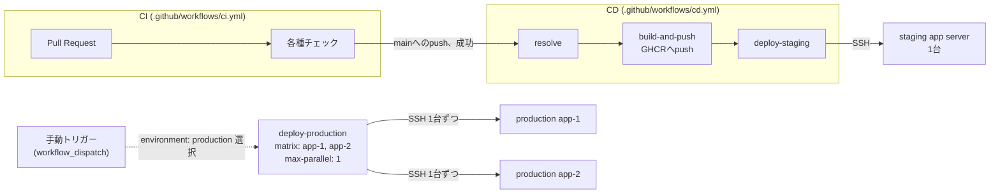

# CD(デプロイパイプライン)設計

最終更新: 2026-09-23(フェーズ13)

このドキュメントは、`main`ブランチの変更をstaging/production環境のアプリサーバへ届けるデプロイパイプラインの設計を定義する。実装は`.github/workflows/cd.yml` + `.github/scripts/deploy-host.sh`(パイプライン本体)、`terraform/modules/app_server`の起動スクリプトに追加した`/opt/levelog/deploy.sh`(各アプリサーバ上で実行される部分)、`docker-compose.prod.yml`(`image:`フィールド追加)。

**実際のGitHub Actions実行・SSHデプロイ・さくらのクラウードの有料リソース作成は本フェーズでも一切行っていない。** アプリサーバ自体がまだ`terraform apply`されておらず実在しないため、デプロイ先が存在しない。本フェーズで検証できたのはワークフロー/スクリプトの静的検証(`actionlint`・`shellcheck`・`bash -n`)と、ローカルで再現可能な部分(`docker-compose.prod.yml`の構文・ビルド、Terraformテンプレートのレンダリング結果)のみである。

## 1. 全体構成

- **自動デプロイはstagingのみ**: `CI`ワークフローが`main`上で成功すると(`workflow_run`トリガー)、`resolve`ジョブは常に`environment=staging`を選び、`deploy-production`は実行されない(`if`条件で環境を突き合わせているため)。
- **productionへのデプロイは常に手動**: `workflow_dispatch`で`environment: production`を明示的に選んだ場合のみ実行される。GitHub Environmentの`production`に対してリポジトリ設定(Settings → Environments)で**Required reviewers**を設定することを強く推奨する(このドキュメント作成時点では未設定 — GitHub側のリポジトリ設定であり、Terraform/YAMLからは構成できないため、リポジトリ作成後に手動で設定する必要がある)。
- **ロールバック**: 同じ`workflow_dispatch`で`image_tag`に過去のコミットSHA(GHCRに既にpush済みのタグ)を指定すると、`build-and-push`ジョブがスキップされ、既存イメージをそのまま再デプロイする。

## 2. イメージのビルド・push

- レジストリは**GitHub Container Registry(GHCR)**を採用した。理由: リポジトリと同じGitHubアカウント配下で完結し、追加のクラウードアカウント・認証情報を要しない(`secrets.GITHUB_TOKEN`のみで認証できる)。さくらのクラウードにもコンテナレジストリ相当のサービスはあるが、現時点でTerraform管理下にもなく、追加の契約・設定が必要になるため見送った。
- イメージ名: `ghcr.io/matsu0122-png/levelog-backend` / `ghcr.io/matsu0122-png/levelog-frontend`。タグは常にコミットSHA(`needs.resolve.outputs.tag`)を主、`latest`を副として両方pushする。
- `docker-compose.prod.yml`に`image: ghcr.io/matsu0122-png/levelog-backend:${IMAGE_TAG:-latest}`(web側も同様)を追加した。`build:`ブロックは削除せず残しており、`docker compose ... up -d --build`によるローカル検証(フェーズ4・11で確立した手順)は引き続き同じコマンドで動作する。本番デプロイでは`--build`を付けず`pull` → `up -d`のみを実行するため、常にGHCRのイメージが使われる。
- GHCRのパッケージはデフォルトでprivate(リポジトリに紐づく)になる。アプリサーバ側からの`docker compose pull`には認証が必要なため、デプロイの都度`docker login ghcr.io`をSSH経由で行う(3節参照)。

## 3. アプリサーバへのデプロイ方式

- Terraformで管理しているのはサーバー本体・ネットワークのみで、コンテナオーケストレーション基盤(Kubernetes等)は導入していない(現状の規模ではオーバースペックと判断、既存方針を踏襲)。そのため、デプロイは**SSH経由でdocker composeを操作する**シンプルな方式とした。
- `.github/scripts/deploy-host.sh`(CIランナー上で実行): 対象ホスト1台に対して
  1. `docker-compose.prod.yml`を`scp`で`/opt/levelog/docker-compose.prod.yml`へ同期(常にリポジトリの最新版を反映)
  2. SSH接続し、`secrets.GITHUB_TOKEN`で`docker login ghcr.io`(このジョブの実行中のみ有効なトークンを都度使用。長期間有効な認証情報をサーバー側に永続化しない設計)
  3. `/opt/levelog/deploy.sh`を`IMAGE_TAG`環境変数付きで実行
  4. `docker logout ghcr.io`(`trap`で保証)
- `/opt/levelog/deploy.sh`(各アプリサーバ上、フェーズ10の起動スクリプトで事前配置済み): `docker compose -f docker-compose.prod.yml pull && docker compose -f docker-compose.prod.yml up -d`を実行し、`/health/ready`が200を返すまで最大60秒ポーリングして確認する。失敗時は非ゼロで終了し、ワークフローを失敗させる。
- **ローリングデプロイ**: production環境はGitHub Actionsの`strategy.matrix` + `max-parallel: 1`で、2台のアプリサーバを**常に1台ずつ順番に**デプロイする(同時に両方落とさない)。1台目のデプロイ(pull→up→ヘルスチェック)が成功して初めて2台目に進む。ロードバランサ(フェーズ11)は`/health/ready`に基づいて自動的にトラフィックを振り分けるため、デプロイ中の1台はLBから自動的に除外される想定(実際の動作確認はフェーズ17の片系停止試験で行う)。
- **`.env`はCIが作成・変更しない**: `DATABASE_URL` / `FRONTEND_ORIGIN` / `COOKIE_DOMAIN` / `TLS_CERT_DIR`等の秘密情報を含む`.env`ファイルは、`/opt/levelog/.env`にサーバー初期構築時に一度だけ手動で作成する運用とした(自動化しない理由: これらの値をGitHub Secretsからサーバーへ転送する経路を作ると、CIの実行権限を持つ者が事実上本番DBの認証情報を扱えることになり、攻撃対象領域が広がるため。台数が2〜3台規模の現状では、初回構築時の手動作業で十分と判断)。`docker-compose.prod.yml`は`.env`ファイルを同じディレクトリから自動的に読み込む(Docker Composeの標準動作)ため、デプロイスクリプト側で`.env`を明示的に指定する必要はない。

## 4. マイグレーション実行の排他制御(フェーズ1からの継続課題の解消)

フェーズ1で指摘した「複数アプリサーバがほぼ同時に起動すると、起動時自動マイグレーションが競合する可能性がある」という課題は、**デプロイパイプラインを分離する方式ではなく、アプリケーションコード側でPostgresのアドバイザリロック(`pg_advisory_lock`)を取る方式**で解消した(`backend/internal/db/migrate.go`)。

- 理由: ローリングデプロイでは2台のアプリサーバがほぼ同時に新しいイメージで起動しうる。デプロイパイプライン側で「マイグレーションを1回だけ実行してからサーバーを起動する」という順序を保証する設計も検討したが、SSHベースの単純なデプロイ方式ではその順序保証自体に別の排他制御が必要になり複雑化する。アプリ起動時に安全な排他制御を組み込むほうが、デプロイ方式に依存せず堅牢(手動でのコンテナ再起動時にも安全)と判断した。
- 実装: `Migrate()`は呼び出しごとに専用コネクションを1本取得し、`pg_advisory_lock`で処理全体(`schema_migrations`テーブルの`CREATE TABLE IF NOT EXISTS`を含む)を排他化する。ロックはセッションスコープのため、コネクションが切断されれば(クラッシュ等でも)自動的に解放され、デッドロックが永続する心配がない。
- **検証**: `backend/internal/db/migrate_test.go`に`TestMigrate_ConcurrentInstancesDoNotRace`(8並行インスタンスでの同時起動を再現)を新規追加。**修正前のコードでこのテストを実行し、実際に`duplicate key value violates unique constraint "pg_type_typname_nsp_index"`エラーで確実に失敗することを確認した上で**、アドバイザリロックを実装し、修正後は`-race`付きで5回連続成功することを確認した(詳細は`docs/production-roadmap.md`フェーズ13節)。

## 5. 必要なGitHub Secrets / Variables(未設定、初回デプロイ前に設定が必要)

| 名前 | 種別 | 用途 |
| --- | --- | --- |
| `DEPLOY_SSH_KEY` | Secret | デプロイ用SSH秘密鍵(`deploy`ユーザーの公開鍵は`terraform/modules/app_server`の`ssh_public_key`変数で各サーバーに配置される、その対の秘密鍵) |
| `STAGING_APP_SERVER_HOST` | Secret | staging環境アプリサーバのIPアドレス/ホスト名 |
| `PRODUCTION_APP_SERVER_HOST_1` / `_2` | Secret | production環境アプリサーバ2台それぞれのIPアドレス/ホスト名 |
| `DEPLOY_USER` | Variable(任意) | SSH接続ユーザー名。未設定時は`deploy`(起動スクリプトの既定値と一致) |

`secrets.GITHUB_TOKEN`はGitHub Actionsが自動的に発行するため追加設定不要(`permissions: packages: write`を`cd.yml`で明示済み)。

## 6. 未確定・今後の判断が必要な事項

- GitHub Environmentの`production`に対するRequired reviewers設定(リポジトリ作成後、Settings画面での手動作業。本フェーズでは実施していない)
- 上記5節のSecrets/Variablesは、実際のアプリサーバがTerraformで構築されて初めて値が定まる(フェーズ17近辺)。それまでこのワークフローは実行できない
- GHCRパッケージの保持ポリシー(古いイメージタグの自動削除)は未設定。ストレージ枯渇の可能性があるため、フェーズ14(監視)またはフェーズ18(運用手順書)で運用ルールを定める
- ロールバック手順は「過去のコミットSHAを`image_tag`に指定して`workflow_dispatch`を実行する」ことを想定しているが、実際のロールバック演習(意図的に古いタグへ戻し、動作を確認する)はフェーズ17で実施する
- `docker-compose.prod.yml`の`image:`に指定したGHCRのリポジトリパス(`matsu0122-png/levelog-*`)は現在のGit remote(`origin`)から導いた固定値。リポジトリの移管・rename時は追従が必要
