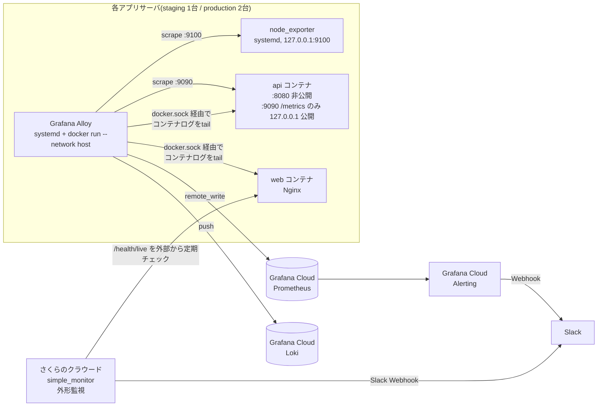

# 監視・ログ・通知 設計

最終更新: 2026-09-27(フェーズ19)

このドキュメントは、Levelogの本番/staging環境における「アプリケーションログ・アクセスログの集約先」「node_exporter(フェーズ10)のスクレイプ方法」「外形監視(フェーズ7の`monitoring`モジュール)のアラート通知先」「アプリケーションメトリクス」「障害時の通知経路」の設計を定義する。

**実際のさくらのクラウードの有料リソース作成・`terraform apply`・Grafana Cloudアカウントの作成・実サーバーへのエージェント導入は本フェーズでも一切行っていない。** 本フェーズで検証できたのは、Goコードの単体・統合テスト、`docker-compose.prod.yml`のローカルビルド・起動確認、Terraformテンプレートのレンダリング結果、そして実際のGrafana Alloyバイナリ(Dockerイメージ`grafana/alloy:v1.19.2`)による設定ファイルの`validate`のみである。

## 1. 全体構成



- 外形監視(`sakuracloud_simple_monitor`、フェーズ7で実装済みのモジュール)と、Grafana Cloudのメトリクス/ログ基盤は**独立した2系統**。外形監視は「サーバー群全体が外から見えているか」だけを見る最後の砦で、アプリ内部の状態(CPU、エラー率など)には関与しない。両者とも同じSlackチャンネルへ通知する想定だが、Webhook URLは別々に発行してよい(1つのSlackチャンネルに複数のIncoming Webhookを紐付けられる)。

## 2. ログ・メトリクスの集約先の選定: Grafana Cloud(無料枠)

選択肢として、(a) Prometheus/Grafana/Lokiを自前でサーバー上に構築、(b) さくらのクラウードのログ関連サービスを利用、(c) Grafana Cloud等の外部SaaSの無料/低コスト枠を利用、の3つを検討した。

- (a) 自前構築は、現状のアプリサーバ(staging 1台・production 2台、2〜4GBメモリ)にさらにPrometheus+Grafana+Lokiを同居させるか、監視専用サーバーを追加で1台契約する必要があり、どちらも避けたい。前者はメモリ枯渇のリスクがあり、後者はフェーズ13で「GHCRの代わりにさくらのクラウードのコンテナレジストリ相当サービスを使わない」と判断したのと同じ理由(追加の契約・運用対象を増やしたくない)で見送った。
- (b) さくらのクラウードのログサービスは本プロジェクトのTerraformで管理していない外部サービスであり、調査コストの割に(c)に対する優位性が薄いと判断した。
- (c) **Grafana Cloudの無料枠**(Prometheus互換メトリクス remote_write、Loki互換ログ、Alerting、ダッシュボードを含む)を採用した。理由: サーバーを一切追加で運用する必要がなく、フェーズ13のGHCR選定(「追加の契約・Terraform管理外の設定を避け、既存の仕組みに乗る」)と一貫した判断。無料枠の上限(執筆時点でメトリクス系列数・ログ取り込み量に上限あり)はこの規模のアプリ(2〜3台構成、想定トラフィックがMVPレベル)であれば十分と判断した。上限に近づいた場合は有料プランへの移行を検討する(フェーズ18の運用手順書で監視ルールとして明記予定)。

この選定により、Terraformで管理するリソースは増えない(Grafana Cloud用のTerraformプロバイダは今回導入しない — 理由は6節)。

## 3. node_exporterのスクレイプ方法

フェーズ10で`node_exporter`を`127.0.0.1:9100`のみでリッスンするsystemdサービスとして導入済みだったが、実際にどう収集するかは本フェーズに委ねられていた。

**採用した方式: 各アプリサーバ上で稼働する Grafana Alloy が `127.0.0.1:9100` をスクレイプし、Grafana CloudへPrometheus remote_writeで転送する。**

- 検討した代替案: (a) SSHトンネル経由で中央のPrometheusサーバーが引きに行く、(b) `node_exporter`自体を外部公開してSaaS側から直接スクレイプさせる。(a)は監視専用サーバーが必要になり2節の判断と矛盾する。(b)は「node_exporterは外部から到達不可能」というフェーズ10の設計判断(セキュリティ上の理由)を覆すことになるため却下した。採用方式は、エージェントが各サーバー内から能動的に外部へpushする(アウトバウンドのみ、インバウンドの穴を一切開けない)ため、フェーズ10の設計を維持できる。

## 4. Grafana Alloyの導入方式

`terraform/modules/app_server/templates/startup.sh.tftpl`に、`node_exporter`導入ブロックの直後として追加した。

- **インストール方法**: `node_exporter`と同様、公式パッケージリポジトリを新たに信頼するのではなく、**Docker Hubの公式イメージ`grafana/alloy:v1.19.2`をバージョン固定で`docker run`する**、systemdユニット(`levelog-alloy.service`)経由の起動とした。Dockerは既にこのサーバーに導入済み(このスクリプトの前段)であり、新たな信頼点(署名鍵・apt リポジトリ)を追加せずに済む。
- **`--network host`を使う理由**: AlloyはDockerソケット経由でコンテナログを検出(`discovery.docker`)しつつ、同時に`127.0.0.1:9100`(node_exporter)と`127.0.0.1:9090`(アプリの`/metrics`、5節参照)へループバック接続する必要がある。後者2つはループバックにのみバインドされているため、Alloyをブリッジネットワークの別コンテナとして動かすと到達できない。`--network host`でホストのネットワーク名前空間を共有するのが最も単純な解決策と判断した。副作用として、Alloy自身のHTTP UI/APIサーバーがホストの全インターフェースにバインドされてしまうのを避けるため、`--server.http.listen-addr=127.0.0.1:12345`を明示し、node_exporterや`/metrics`と同じ「ループバックのみ」の姿勢を保っている。
- **設定ファイル(`/etc/levelog/alloy-config.alloy`)**: このスクリプトが直接書き出す(秘密情報を含まない、静的な設定のみ)。実際のGrafana CloudのURL・APIキーはすべて`sys.env(...)`関数で実行時に環境変数から読む設計にした(下記)。
- **秘密情報(`/etc/levelog/monitoring.env`)**: このスクリプトは空ファイルを作成する(`touch` + `chmod 600`)のみで、中身は書き込まない。`docker-compose.prod.yml`の`.env`と同じ理由(`docs/deployment-design.md`5節)で、実際の値はサーバー初期構築時に手動で設定する運用とした。ファイルが空のままでもAlloyサービス自体は起動し、スクレイプは成功するが、送信先が空文字列になるため実際には何も送信されない(サイレントに壊れるのではなく、Alloy自身のログにpush失敗として記録される)。
- **必要な環境変数**(`/etc/levelog/monitoring.env`に設定する):

| 変数名 | 用途 |
| --- | --- |
| `GRAFANA_CLOUD_PROMETHEUS_URL` | Prometheus remote_writeエンドポイントURL(Grafana Cloudのスタック詳細ページで確認) |
| `GRAFANA_CLOUD_PROMETHEUS_USER` | 同上のBasic認証ユーザー名(Grafana CloudのInstance ID) |
| `GRAFANA_CLOUD_LOKI_URL` | Lokiのpushエンドポイント URL |
| `GRAFANA_CLOUD_LOKI_USER` | 同上のBasic認証ユーザー名(Instance ID) |
| `GRAFANA_CLOUD_API_KEY` | 上記すべてに共通して使うAPIキー(Grafana Cloudの Access Policy Token。`metrics:write`・`logs:write`スコープが必要) |

- **`environment`ラベル**: `staging`/`production`を区別するため、Terraform変数`environment_name`(`terraform/modules/app_server`に新規追加、非秘密)をAlloy設定の`external_labels`(メトリクス)・`labels`(ログ)に直接埋め込んでいる。1つのGrafana Cloudアカウントを両環境で共用しつつ、ダッシュボード/アラートで`environment`ラベルで絞り込める。
- **`host`ラベル(フェーズ19で追加)**: Alloyの`constants.hostname`(サーバーのホスト名)を、メトリクスの`external_labels`とログの`labels`に付ける。各サーバーのAlloyはどれも`127.0.0.1:9100`/`127.0.0.1:9090`をスクレイプするため、`instance`ラベルは全サーバーで同じになる。`host`がないとproductionの2台がまったく同じラベルの系列を送ってしまい、Grafana Cloud側で区別できない(サンプルが混ざり、順序違反で書き込みが拒否される)。フェーズ14の設計ではこの点が抜けていた。修正後の設定を実際の`grafana/alloy:v1.19.2`で起動し、全コンポーネントがhealthyになることを確認した。

## 5. アプリケーションメトリクス(エラー率・レイテンシ)

`backend/internal/metrics`パッケージを新規追加した。

- Prometheusのテキスト形式(`https://prometheus.io/docs/instrumenting/exposition_formats/`)を手書きで出力する自前実装とした。`client_golang`を採用しなかった理由: 必要なメトリクスはリクエスト件数とレイテンシの2種類のみで、依存関係を増やすほどの価値がないと判断した(既存の依存は`pgx`と`golang.org/x/crypto`のみ)。
- 収集するメトリクス:
  - `levelog_http_requests_total{method,route,status}`(カウンター) — エラー率は`status=~"5.."`で算出可能。
  - `levelog_http_request_duration_seconds{method,route}`(ヒストグラム、`_bucket`/`_sum`/`_count`) — p50/p95/p99レイテンシをPromQLの`histogram_quantile`で算出可能。
  - ラベル`route`には生のURLパスではなく、`http.ServeMux`に登録されたパターン文字列(例: `GET /api/missions/{id}`)を使う(`mux.Handler(r)`の戻り値)。生パスを使うとミッションIDやユーザーIDの数だけラベルの組み合わせが増え(カーディナリティ爆発)、Grafana Cloudの無料枠の系列数上限を無駄に消費するため。
- **公開方法**: `/metrics`はメインの`router`(`handler.NewRouter`が返す`http.Handler`)には含めず、`cmd/api/main.go`で別ポート(`METRICS_PORT`、デフォルト`9090`)の専用HTTPサーバーとして公開している。理由: `/metrics`には認証がなく、Nginx(`frontend/nginx-locations.conf`)は`/api/`と`/health/`しかバックエンドへプロキシしないため元々インターネットには晒されないが、念のためアプリ本体のポート(8080)とも分離し、`docker-compose.prod.yml`側で`9090`のみを`127.0.0.1`にバインドして公開する(node_exporterと同じ「ループバックのみ」の姿勢)。
- `backend/internal/middleware/metrics.go`が実際の計測を行うミドルウェアで、`mux`を直接ラップする(他のミドルウェアより内側)ことで`mux.Handler(r)`が正しいパターンを解決できるようにしている。

## 6. アラート設計・障害時の通知経路

Grafana Cloudの契約自体(アカウント作成・APIキー発行)は本フェーズの範囲外(実際のクラウードリソースを持つ第三者サービスのアカウント作成を伴うため、Terraformでも自動化していない — さくらのクラウードの有料リソース同様、ユーザー自身の判断で行う手動作業とした)。そのため、フェーズ14ではアラートルールを設計のみとした。**フェーズ19で、ルールをコードとして実装した**(`monitoring/alerts/levelog.rules.yml`、6.1節)。

アラートルール(下表はフェーズ14の設計。実装では、低トラフィック時の誤報を防ぐ下限や、グループ化の単位などを加えている。正確な条件はルールファイルを参照):

| アラート | 条件(目安) | 通知先 |
| --- | --- | --- |
| 5xxエラー率上昇 | `sum(rate(levelog_http_requests_total{status=~"5.."}[5m])) / sum(rate(levelog_http_requests_total[5m])) > 0.05` が5分継続 | Slack |
| レイテンシ悪化 | `histogram_quantile(0.95, rate(levelog_http_request_duration_seconds_bucket[5m])) > 1`(秒)が5分継続 | Slack |
| ディスク逼迫 | node_exporterの`node_filesystem_avail_bytes / node_filesystem_size_bytes < 0.15` | Slack |
| メモリ逼迫 | node_exporterの`node_memory_MemAvailable_bytes / node_memory_MemTotal_bytes < 0.10` | Slack |
| エージェント停止(死活監視のdead man's switch) | 対象サーバーからの`up{job=~"levelog_node|levelog_api"}`が5分欠落 | Slack |

### 6.1 実装(フェーズ19)

- **形式**: Prometheusのルール形式(`monitoring/alerts/levelog.rules.yml`)。Grafana CloudのMimir ruler(Grafanaの「データソース管理」のアラートルール)がそのまま評価する。Terraformの`grafana`プロバイダではなくこの形式を選んだ理由は2つ。(1) `promtool test rules`で、実際に発火する・しないを単体テストできる(`levelog.rules.test.yml`、CIの`monitoring-rules`ジョブで実行)。(2) Grafana CloudのAPIキーをTerraformのstateに入れずに済む。
- **設計からの変更点**:
  - 5xxエラー率・p95レイテンシは、`environment`単位で集計する(ユーザーが体感するのはLB配下の合計)。リクエストが0.1 req/s未満のときは発火しない(深夜に2件中1件が500になっただけで50%と判定されるのを防ぐ)。
  - 「エージェント停止」は2つに分けた。`LevelogScrapeTargetDown`(Alloyは動いているが、node_exporterやapiのスクレイプに失敗している: `up == 0`)と、`Levelog{Production,Staging}ServersNotReporting`(送信しているサーバーの数が`server_count`に満たない。サーバーが丸ごと落ちると`up`系列自体が消えて`up == 0`では検知できないため)。後者の期待台数(production 2 / staging 1)は`terraform/environments/*/main.tf`の`server_count`と揃える必要がある。
  - テストでは、ルールを意図的に壊した版が失敗することも確認した(閾値の変更、`or vector(0)`の削除)。
- **Grafana Cloudへの登録(アカウント作成後に1回、手元で実行)**:
  ```bash
  # Grafana Cloudポータル > Prometheusの詳細 で確認できるURL・ユーザーID。APIキーには rules:write 権限が必要
  mimirtool rules load monitoring/alerts/levelog.rules.yml \
    --address https://prometheus-<region>.grafana.net/api/prom \
    --id <PrometheusのユーザーID> --key <APIキー>
  # 反映の確認
  mimirtool rules list --address ... --id ... --key ...
  ```
  ルールを変更したときも同じコマンドで上書きされる。`mimirtool rules check`(mimirtool 3.2.1)と`promtool check rules`で、ファイルがそのまま読み込める形式であることを確認済み。
- **通知**: Grafana Cloud AlertingのContact PointにSlackのIncoming Webhookを登録し、Notification policyで`severity=critical|warning`をそこへ送る(UIでの1回限りの設定。Webhook URLは秘密情報なのでリポジトリには置かない)。

### 6.2 通知先

- 通知先はSlack(Incoming Webhook、Grafana Cloud AlertingのContact Point経由)に統一する。既存の外形監視(2節・フェーズ7)のSlack通知先(`monitor_slack_webhook`変数)と同じチャンネルへ通知してよいが、Webhook URL自体は別発行にする(1つのアラート基盤の不調がもう片方の通知を道連れにしないため)。
- staging環境にも外形監視(`sakuracloud_simple_monitor`)を本フェーズで新規に配線した(`terraform/environments/staging/main.tf`)。これまでproductionのみ配線されており、staging側の外形監視が抜けていたギャップを埋めた。Grafana Cloud側のメトリクス/ログ(node_exporter・アプリ)は`environment`ラベルで両環境を区別しつつ同一アカウントを使うため、staging用に追加のTerraformリソースは不要。

## 7. 未確定・残っている課題

- **Grafana Cloudアカウントの作成・APIキー発行**(手動作業、未実施)。作成後、各アプリサーバの`/etc/levelog/monitoring.env`に4節の環境変数を設定する必要がある(サーバー自体がまだ`terraform apply`されていないため、実施できるのはアプリサーバ構築後)。
- ~~Grafana Cloud Alertingのルール自体の作成~~ → フェーズ19でコード化(6.1節)。Grafana Cloudへの登録とSlackのContact Point設定は、アカウント作成後の手動作業として残る。
- **Nginx(`web`コンテナ)自体のメトリクス**(リクエスト数、接続数等)は本フェーズでは収集対象に含めなかった。理由: 本フェーズの明示スコープ(アプリケーションのエラー率・レイテンシ)はバックエンドAPI側の`/metrics`で満たせており、Nginx側は`stub_status`モジュールの追加(`frontend/nginx.conf`の変更)を伴う別スコープの変更になるため、必要になった時点(フェーズ17の負荷試験等でボトルネック調査が必要になった場合)に追加する。
- **Grafana Alloyの`docker run`イメージバージョン固定(`v1.19.2`)の更新ポリシー**は未定義。セキュリティ更新の追随方法はフェーズ16またはフェーズ18で検討する。
- **GHCRパッケージの保持ポリシー**(フェーズ13からの継続課題)、**`matsu0122.com`ゾーンの管理場所確認・証明書更新自動化**(フェーズ11からの継続課題)、**Terraform stateのリモートbackend移行**(フェーズ7からの継続課題)、**アプリサーバ内部NICの静的IP割り当て**(フェーズ8からの継続課題)は引き続き未解消。
