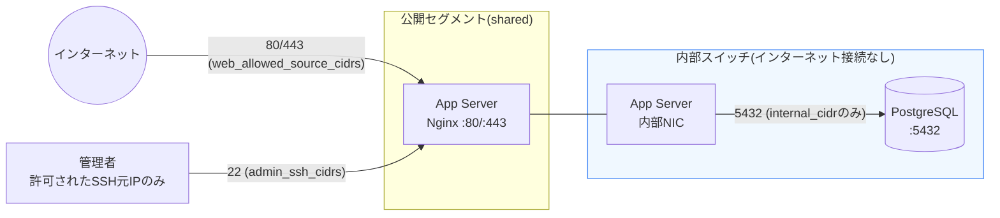
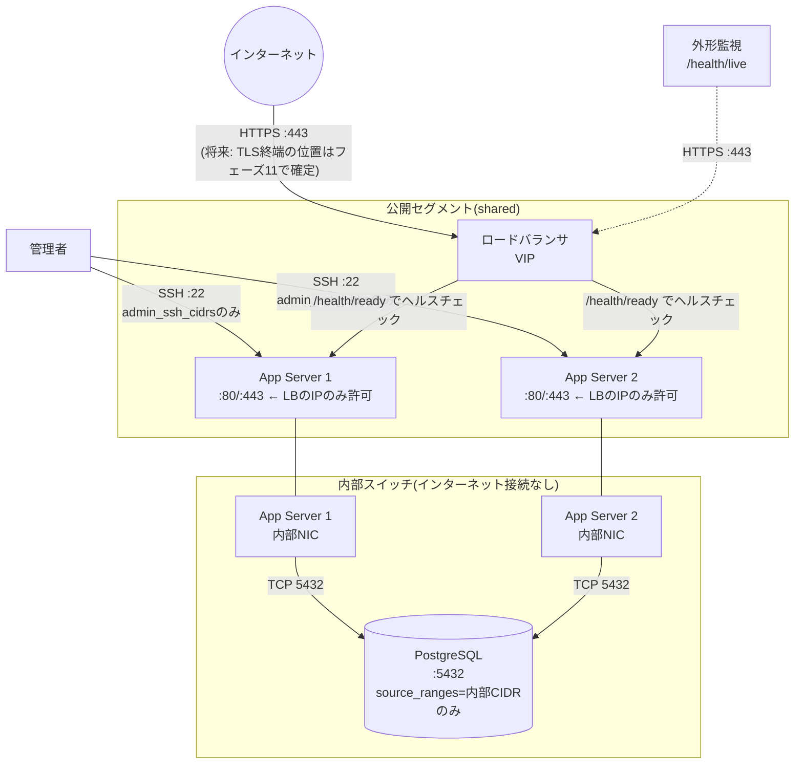

# ネットワーク構築準備

最終更新: 2026-09-23(フェーズ8)

このドキュメントは、Levelogのさくらのクラウードネットワーク構成(通信の許可範囲・管理接続方式)を定義する。実装は`terraform/modules/network`と`terraform/environments/{staging,production}`(フェーズ7で作成、本フェーズで拡張)。クラウドリソースの作成・`terraform apply`は本フェーズでも行っていない。

## 1. ネットワークの全体像

| ネットワーク | 接続されるもの | インターネット接続 |
| --- | --- | --- |
| 公開セグメント(`shared`、さくらのクラウードの共用インターネット接続) | アプリサーバの1枚目のNIC | あり(グローバルIP) |
| 内部スイッチ(`terraform/modules/network`で作成) | アプリサーバの2枚目のNIC、DBアプライアンス | なし(ルータ非接続、構造的にインターネットから到達不可) |
| ロードバランサ用の公開(ルーティング済み)スイッチ | ロードバランサ(production限定) | あり(フェーズ11で構築、本フェーズのスコープ外) |

DBが内部スイッチにのみ接続され、かつそのスイッチ自体にルータ/インターネット接続がないことが、「DBをインターネットへ公開しない」という制約に対する構造的な保証になっている(パケットフィルタの設定ミスに依存しない、ネットワークトポロジーそのものによる保証)。

## 2. 公開・非公開通信の分離

- **公開セグメント**: アプリサーバの1枚目のNIC(`upstream = "shared"`)のみが接続する。ここには`terraform/modules/network`のパケットフィルタ(`sakuracloud_packet_filter.app_public`)を適用し、許可するのは次の3種類のみ:
  - TCP 80 / 443(`web_allowed_source_cidrs`から): stagingは`0.0.0.0/0`(ロードバランサがないため直接公開)、productionはロードバランサの実IPのみに絞る(後述)。
  - TCP 22(`admin_ssh_cidrs`から、後述)。
  - ICMP(疎通確認用)。
  - 上記以外はパケットフィルタの暗黙の最終拒否により遮断される。
- **内部スイッチ**: アプリサーバの2枚目のNICとDBのみが接続し、インターネットへの経路自体が存在しない。DB側でさらに`source_ranges`により内部CIDR以外からのアクセスを拒否する(二重の防御)。

## 3. SSH接続制限

- SSHは公開セグメント経由(TCP 22)でのみ提供し、`admin_ssh_cidrs`変数で明示的に許可した送信元CIDRからのみ許可する。この変数には**デフォルト値を設定していない**(空・ワイルドカードのまま使われる事故を防ぐため、`terraform/modules/network/variables.tf`の`validation`ブロックで空リストも拒否している)。
- パスワード認証は無効化済み(`terraform/modules/app_server/main.tf`の`disk_edit_parameter.disable_pw_auth = true`、フェーズ7で実装)。鍵認証のみを許可する。
- 現在の規模(アプリサーバ最大2台)では踏み台(bastion)サーバーは導入せず、各アプリサーバへ直接SSHする方式とする。管理者のIPが固定でない場合(自宅回線の動的IP等)は、都度`admin_ssh_cidrs`を更新して`terraform apply`するか、将来的にVPN(さくらのクラウードの「セキュアモバイル」等)の導入を検討する。この判断は運用開始後の実態を見て再評価する。

## 4. 管理接続方式(まとめ)

| 項目 | 方式 |
| --- | --- |
| 接続手段 | SSH(鍵認証のみ、パスワード認証無効) |
| 接続元制限 | `admin_ssh_cidrs`によるIP許可リスト(パケットフィルタで強制) |
| 踏み台サーバー | なし(現規模では直接SSH。将来的な見直し余地あり) |
| デプロイ用ユーザー | フェーズ10(アプリサーバ構築)で作成する専用ユーザーを想定。rootでの直接ログインは許可しない方針とする |
| 秘密鍵の管理 | Terraformの`ssh_public_key`変数には公開鍵のみを渡す。秘密鍵はリポジトリ・Terraform状態のどこにも保存しない |

## 5. AppからDBへの通信ルール

- 許可プロトコル/ポート: TCP 5432(PostgreSQL、既定ポート)のみ。
- 許可元: 内部スイッチのCIDR(`internal_cidr`、既定`192.168.100.0/24`)全体。DBの`network_interface.source_ranges`でこの1点のみを許可している(`terraform/modules/database/main.tf`、フェーズ7で実装)。
- **現状はサブネット単位の制限**であり、アプリサーバ個々の内部IPを固定してその1台単位まで絞り込む設計にはしていない。理由: アプリサーバの内部NIC(2枚目)に静的IPを割り当てる`disk_edit_parameter`の挙動(どちらのNICに適用されるか)を、実際のさくらのクラウード環境で検証せずに断定することを避けたため(フェーズ7の実装時点からの継続判断)。内部スイッチには現状アプリサーバとDБ以外何も接続されないため、サブネット単位の制限でも実質的な効果は同じだが、より厳密な単一ホスト制限は、静的内部アドレッシングを実環境で検証できるタイミング(フェーズ10近辺)で追加する。
- アプリサーバの内部NIC側にはパケットフィルタを適用していない(発信側であり、Sakura Cloudのパケットフィルタは主に着信制御のため。制御の実体はDB側の`source_ranges`)。

## 6. 詳細ネットワーク構成図(production、フェーズ11完了時点の想定)

staging構成図は[`docs/staging-environment.md`](./staging-environment.md)の第7節を参照(ロードバランサなし、アプリサーバの公開NICが直接インターネットに面する点のみが異なり、内部スイッチ以降の構成は同一)。

## 7. 本フェーズでの実装内容(Terraform)

- `terraform/modules/network`に`admin_ssh_cidrs`(必須、デフォルトなし)と`web_allowed_source_cidrs`(既定`0.0.0.0/0`)を追加し、パケットフィルタのルールをSSH/HTTP/HTTPS/ICMPの明示的な許可リストに置き換えた(以前はICMPのみのプレースホルダー)。
- `terraform/environments/{staging,production}`に`admin_ssh_cidrs`変数を追加し、network moduleへ受け渡すようにした。
- productionのみ、`web_allowed_source_cidrs`をロードバランサの実IP(`lb_ip_addresses`、/32ずつ)に絞り込むよう設定(stagingは既定の`0.0.0.0/0`のまま、ロードバランサがないため)。

## 8. 未確定・今後の判断が必要な事項

- アプリサーバ内部NICへの静的IP割り当てとDB `source_ranges`の単一ホスト単位への絞り込み(フェーズ10近辺で実環境検証の上、判断)
- 踏み台サーバー導入の要否(運用開始後の実態を見て再評価)
- デプロイ用ユーザーの具体的な権限設計(フェーズ10)
- TLS終端の位置(アプリサーバのNginx側か、別途検討か)はフェーズ11で確定
