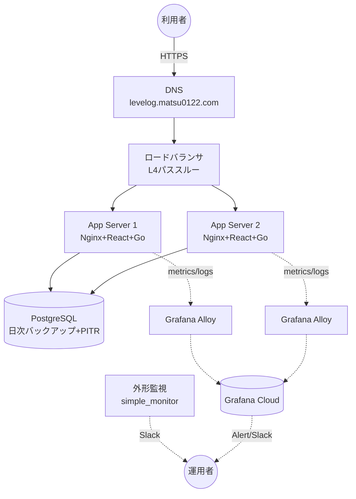

# 運用手順書

最終更新: 2026-09-23(フェーズ18)

このドキュメントは、Levelogを実際に本番運用する担当者(現状は開発者本人)向けの実務手順書。フェーズ1〜17で設計・実装してきた内容を「実際に何をどの順番で行うか」という形にまとめ直したもので、新しい設計判断はほぼ含まない(各判断の背景・理由は個別のdocs/*.mdを参照)。大規模な運用チームを前提とせず、単独(または少人数)の開発者が自分でオペレーションする前提で書いている。

## 1. システム構成の要約



- production: アプリサーバ2台(ローリングデプロイ)+ロードバランサ+PostgreSQL(日次バックアップ+PITR)。
- staging: アプリサーバ1台、LBなし(DNSから直接)、PostgreSQL(日次バックアップのみ)。
- コードはGitHub、CIは`.github/workflows/ci.yml`、CDは`.github/workflows/cd.yml`、インフラはTerraform(`terraform/environments/{staging,production}`)。

各コンポーネントの設計根拠は次のドキュメントを参照。

| コンポーネント | ドキュメント |
| --- | --- |
| Go API本番対応 | `docs/production-roadmap.md`フェーズ2 |
| Frontend/コンテナ構成 | `docs/production-roadmap.md`フェーズ3・4 |
| staging/production分離 | `docs/staging-environment.md` |
| ネットワーク | `docs/network-design.md` |
| PostgreSQL | `docs/database-design.md` |
| アプリサーバ | `docs/app-server-design.md` |
| ロードバランサ・DNS・TLS | `docs/tls-design.md` |
| CD(デプロイ・ロールバック) | `docs/deployment-design.md` |
| 監視・ログ | `docs/monitoring-design.md` |
| バックアップ・復元 | `docs/backup-restore-design.md` |
| セキュリティ | `docs/security-review.md` |
| 障害試験・負荷試験の結果 | `docs/load-test-results.md` |

## 2. 初回構築手順(ゼロから公開まで)

**現時点でこの手順は一度も実行されていない。** さくらのクラウードの実リソースはまだ何も作成されておらず、以下はすべて「今後、担当者が自分の判断と権限で行う」手順として記載する。各手動ステップの詳細な理由は各docsを参照(ここでは手順の列挙のみ)。所要時間は目安。

### 2.1 前提条件(公開判定と同じ内容、詳細は`docs/go-live-readiness.md`)

1. さくらのクラウードのアカウント・APIキー(`SAKURACLOUD_ACCESS_TOKEN` / `SAKURACLOUD_ACCESS_TOKEN_SECRET`)を発行する。
2. デプロイ用SSH鍵ペアを生成する(公開鍵は`terraform.tfvars`または`-var`で`ssh_public_key`に渡す。秘密鍵は後述のGitHub Secretsに登録)。
3. 管理者(自分)のグローバルIPアドレスを確認し、`admin_ssh_cidrs`に設定する準備をする(固定IPでない場合は都度更新が必要になる点に留意)。
4. `matsu0122.com`ゾーンの現在の管理場所を確認する(`docs/tls-design.md`6節)。
5. さくらのクラウードの各種プラン名・イメージ名の最新値をコントロールパネルまたはAPIで確認する(`os_type`・DBの`plan`・`database_version`・LBの`plan`など、コード中に「要確認」と明記されている暫定値、`docs/backup-restore-design.md`2節・`terraform/modules/*/variables.tf`のコメント参照)。

### 2.2 Terraform適用の順序

`terraform/environments/staging`から先に適用し、動作確認してから`production`に進むことを推奨(設計は完全に分離されているため、production側のみ先行させることも技術的には可能)。

1. `terraform/environments/{staging,production}`それぞれで`terraform.tfvars.example`を`terraform.tfvars`にコピーし(`.gitignore`済み)、非秘密値を埋める。秘密値(`db_admin_password`等)は`TF_VAR_*`環境変数で渡す。
2. `terraform init`
3. `terraform plan`で内容を確認する。**この段階で初めて実際のさくらのクラウードAPIへ到達する。** それまでのすべてのフェーズでの検証は、認証情報なしでエラー終了することの確認までに留めてきた。
4. 内容に問題なければ`terraform apply`。
   - production環境は`docs/tls-design.md`2節の「2段階ブートストラップ」に注意: 初回applyは`lb_known_ip_addresses`が空のまま(パケットフィルタが一時的に全世界公開の状態になる、ヘルスチェックパス以外は影響小)で行い、ロードバランサの実IPを確認してから`lb_known_ip_addresses`を設定して再apply する。
5. `module.database`(`postgresql`プロバイダ)の適用は、DBアプライアンスの内部ネットワークに到達できる場所から実行する必要がある(`docs/database-design.md`2節)。開発者の自宅PCから直接は実行できない。踏み台またはCI/CDランナーの配置を検討する。

### 2.3 apply後の手動セットアップ(各アプリサーバ上)

Terraformの起動スクリプトが土台を作るが、秘密情報を含む以下のファイルは意図的に自動化していない(`docs/deployment-design.md`5節・`docs/monitoring-design.md`4節 — CI/Terraformの実行権限が本番の秘密情報に直結しないようにするための設計判断)。SSHで各サーバーへ接続し、手動で作成する。

1. `/opt/levelog/.env` — `DATABASE_URL` / `FRONTEND_ORIGIN` / `COOKIE_DOMAIN`(空のままでよい、`docs/staging-environment.md`4節) / `COOKIE_SECURE=true`等。
2. TLS証明書 — さくらのクラウードDNSのDNS-01チャレンジで**初回のみ**手動発行する(`docs/tls-design.md`4節)。以降の更新は`certbot.timer`とデプロイフックが自動で行う。
   ```bash
   # さくらのクラウードのAPIキー(DNSの操作権限のみを持つものを推奨)
   sudo install -m 0600 /dev/null /etc/letsencrypt/sakuracloud.ini
   sudoedit /etc/letsencrypt/sakuracloud.ini
   #   dns_sakuracloud_api_token  = <アクセストークン>
   #   dns_sakuracloud_api_secret = <アクセストークンシークレット>
   sudo certbot certonly --non-interactive --agree-tos -m <連絡先メール> \
     --authenticator dns-sakuracloud \
     --dns-sakuracloud-credentials /etc/letsencrypt/sakuracloud.ini \
     --dns-sakuracloud-propagation-seconds 120 \
     --deploy-hook /etc/letsencrypt/renewal-hooks/deploy/levelog.sh \
     -d levelog.matsu0122.com          # stagingは staging.levelog.matsu0122.com
   ls -l /opt/levelog/tls/               # fullchain.pem / privkey.pem(uid 101所有)ができていること
   sudo certbot renew --dry-run          # 自動更新が通ることの確認
   ```
   `matsu0122.com`ゾーンがさくらのクラウードDNS以外で管理されている場合(2.1の4)は、この手順は使えない。ゾーンをさくらのクラウードDNSへ移すか、そのDNS事業者向けのcertbotプラグインに差し替える(デプロイフック以降はそのまま使える)。
3. `/etc/levelog/monitoring.env` — `GRAFANA_CLOUD_PROMETHEUS_URL` / `_USER`、`GRAFANA_CLOUD_LOKI_URL` / `_USER`、`GRAFANA_CLOUD_API_KEY`(`docs/monitoring-design.md`4節の表を参照。Grafana Cloudアカウント自体の作成が先に必要)。
4. Grafana Cloudへのアラートルールの登録(アカウントにつき1回、サーバー上ではなく手元で実施) — `docs/monitoring-design.md`6.1節の`mimirtool`コマンド。

### 2.4 DNS設定(ユーザーの明示的な許可が必要な操作)

`docs/tls-design.md`6節の表の通り、`levelog.matsu0122.com`をロードバランサのVIPへ、`staging.levelog.matsu0122.com`をstagingアプリサーバの公開IPへ向ける。ゾーンの管理場所によって設定方法が変わる(2.1の4を参照)。

### 2.5 GitHub側の設定

| 項目 | 種別 | 内容 |
| --- | --- | --- |
| `DEPLOY_SSH_KEY` | Secret | 2.1の2で生成した秘密鍵 |
| `STAGING_APP_SERVER_HOST` | Secret | staging環境アプリサーバのIP |
| `PRODUCTION_APP_SERVER_HOST_1` / `_2` | Secret | production環境アプリサーバ2台のIP |
| `DEPLOY_USER` | Variable(任意) | 既定`deploy`のため通常未設定でよい |
| GitHub Environment `production`のRequired reviewers | リポジトリ設定 | 手動設定、`docs/deployment-design.md`6節 |

設定後、`main`へのマージでstagingへ自動デプロイされるようになる(`docs/deployment-design.md`1節)。productionは`workflow_dispatch`による手動デプロイのみ。

### 2.6 最初の動作確認

1. staging環境で新規登録・ログイン・ミッション作成・完了・履歴表示・ログアウトの一連の操作を実際のブラウザで確認する。
2. `/health/ready`・`/metrics`(サーバー内部からのみ)・Grafana Cloud上でメトリクス/ログが実際に届いていることを確認する。
3. 問題なければproduction環境も同様に確認し、DNSを切り替える。

## 3. 日常のデプロイ

- `main`へのマージ → CI成功 → stagingへ自動デプロイ。stagingで動作確認。
- 問題なければ、GitHub Actionsの`workflow_dispatch`で`cd.yml`を手動実行し、`environment: production`を選択してデプロイ(`image_tag`は省略時は最新のコミットSHA)。
- productionは2台をmax-parallel: 1で順番にデプロイ(ローリング、`docs/deployment-design.md`1節)。
- **デプロイ後の自動スモークテスト**: `/health/ready`の合格後、`.github/scripts/deploy-host.sh`が各サーバー上で`.github/scripts/smoke-test.sh`を実行する(HTTP→HTTPSリダイレクト、SPA配信、セキュリティヘッダー、未認証時の401、存在しないユーザーでのログインが401になること、証明書の残り日数)。データは一切書き込まないのでproductionでも安全。失敗するとジョブが失敗し、productionでは2台目へのデプロイに進まない。その場合は4節の手順でロールバックする。フェーズ17で確認した「ヘルスチェックは通るがログインが500を返す」退行を、このスモークテストが検知することをローカルで確認済み(`docs/load-test-results.md`3節)。

## 4. ロールバック

`workflow_dispatch`の`image_tag`入力に、過去の(GHCRへpush済みの)コミットSHAを指定して再実行する。`build-and-push`ジョブはスキップされ、既存イメージがそのまま再デプロイされる。この手順自体は、ローカルでのシミュレーションで実際に機能することを確認済み(`docs/load-test-results.md`3節)。

## 5. 障害対応

### 5.1 アプリサーバ1台が応答しない

ロードバランサが`/health/ready`のヘルスチェックで自動的に切り離すはずなので、まずはサービス影響がないか(残りの1台で捌けているか)を確認する。その上で、当該サーバーへSSH接続し、`docker compose -f /opt/levelog/docker-compose.prod.yml ps` / `logs`で状況を確認する。コンテナ再起動で直らない場合はサーバー自体の状態(さくらのクラウードのコントロールパネルの「コンソール」機能でOSレベルの状態を確認、`docs/app-server-design.md`3節)を見る。

### 5.2 DBに接続できない

アプリケーションは`pgx`の自動再接続に対応しているため、DBが復旧すればアプリの再起動は不要(`docs/load-test-results.md`2節で実機確認済み)。DB自体が本当に落ちている場合は、さくらのクラウードのコントロールパネルでアプライアンスの状態を確認し、必要であればバックアップからの復元(`docs/database-design.md`8節・`docs/backup-restore-design.md`3節)を検討する。

### 5.3 デプロイ後に不具合が発覚した

4節の手順でロールバックする。

### 5.4 秘密情報が漏洩した疑いがある

- DBパスワード: `terraform apply`でローテーション(`db_admin_password`/`db_app_password`を変更して再apply)。
- SSH鍵: 新しい鍵ペアを生成し、`ssh_public_key`変数を更新して再apply、GitHub Secretsの`DEPLOY_SSH_KEY`も更新。
- Grafana Cloud APIキー: Grafana Cloud側で無効化・再発行し、各サーバーの`/etc/levelog/monitoring.env`を更新後`systemctl restart levelog-alloy`。
- Slack Webhook: Slack側で再発行し、Terraform変数を更新して再apply。

## 6. 監視・アラートへの対応

アラートルールは`monitoring/alerts/levelog.rules.yml`にコードとして定義済み(5xxエラー率・p95レイテンシ・ディスク・メモリ・スクレイプ失敗・サーバーからの送信停止)。CIの`promtool test rules`で単体テストされている。Grafana Cloudへの登録は2.3節の4(`docs/monitoring-design.md`6.1節)。各アラートの説明文に、最初に確認すべき場所を書いてある。さくらのクラウードの外形監視(`simple_monitor`)は、死活監視(`/health/live`)と証明書の残り日数(14日未満で通知)の2つがTerraformで定義済みで、apply後すぐにSlack通知が機能する。証明書の通知が来た場合は、自動更新が止まっている(`systemctl status certbot.timer`、`journalctl -u certbot`)。

## 7. 定期メンテナンス

- **依存パッケージ・コンテナベースイメージの更新確認**: フェーズ16で、`golang:1.23-alpine`・`alpine:3.20`・`node:20-alpine`・`nginx-unprivileged:1.27-alpine`のすべてが気づかないうちにDocker Hub上でEOL/削除されていたことが判明した(`docs/security-review.md`5節)。CIに`trivy`・`govulncheck`・`npm audit`を組み込んだことで新規の脆弱性は継続的に検知できるが、**ベースイメージの世代交代(EOLになる前の計画的な更新)は自動化されていない。** 数ヶ月に一度、`backend/Dockerfile`・`frontend/Dockerfile`のベースイメージタグが現行サポート範囲内かを確認することを推奨する。
- **GHCRパッケージの保持ポリシー**: 未設定(フェーズ13から継続課題)。イメージが際限なく溜まる前に保持世代数を設定する。
- **Terraform stateのバックアップ**: リモートbackend未移行(7節参照)のため、ローカルの`terraform.tfstate`を独自にバックアップする運用が必要(移行までの暫定対応)。
- **セッションテーブルの自動クリーンアップ**: フェーズ18で実装済み(`backend/internal/service/session_cleanup.go`、1時間ごとに期限切れセッションを削除)。追加の運用作業は不要。

## 8. 既知の制約・今後の課題

以下は「今すぐ公開を妨げるものではないが、認識した上で運用すべき事項」。詳細・背景は各フェーズのドキュメントを参照。

| 項目 | 内容 | 参照 |
| --- | --- | --- |
| Terraform stateがローカルbackend | リモートbackendへの移行が未実施。担当者のローカル環境が失われるとstateも失われる | フェーズ7から継続 |
| DB冗長構成(フェイルオーバー) | レプリカの実際の作成・紐付けは手動操作が必要、未実施 | `docs/database-design.md`3節 |
| Grafana Cloudのアラートルール | コード化・単体テスト済みだが、Grafana Cloudへの登録はアカウント作成後(2.3節) | `docs/monitoring-design.md`6節 |
| レート制限が単一プロセス内でのみ有効 | production2台構成で、実効上限が単純に2倍になる程度の粗さ | `docs/security-review.md`1節 |
| セッションの固定30日・スライディング延長なし | 意図的な現状維持、将来見直す可能性あり | `docs/security-review.md`1節 |
| アプリサーバ内部NICの静的IP割り当て | 実環境検証待ち | フェーズ8から継続 |

## 9. 緊急時のroot操作

SSH経由のroot直接ログインは無効化されている(`docs/app-server-design.md`3節)。緊急時は、さくらのクラウードのコントロールパネルの「コンソール」機能(シリアルコンソール相当)からOSへ直接アクセスする。
