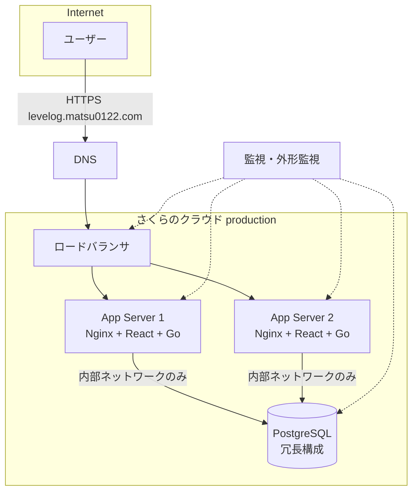
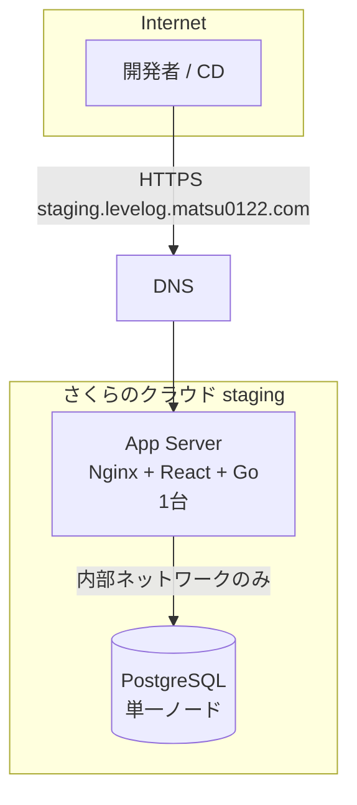

# staging環境設計

最終更新: 2026-09-23(フェーズ6)

このドキュメントは、Levelogを`staging`環境と`production`環境に分離して運用するための設計を定義する。実際のTerraformコード(プロバイダ設定・モジュール・variables等)はフェーズ7で実装する。本ドキュメントはその前提となる設計方針を固めるものであり、本フェーズではクラウドリソースの作成・Terraform実行・DNS変更は一切行わない。

## 1. ドメイン設計

| 環境 | ドメイン | 用途 |
| --- | --- | --- |
| production | `levelog.matsu0122.com` | 実際のユーザーが利用する本番環境 |
| staging | `staging.levelog.matsu0122.com` | リリース前の動作確認・CD(デプロイパイプライン)からの自動デプロイ先 |

DNSレコードの実際の作成・変更はフェーズ11(ロードバランサ・DNS・HTTPS)で行う。本フェーズでは命名規則とゾーン設計のみを定める。

- 両ドメインとも同一のさくらのクラウードDNSゾーン(`matsu0122.com`)の下で管理する。
- `staging`はサブドメインとして分離するため、`levelog.matsu0122.com`とは別のAレコード(または将来的にロードバランサを立てる場合はそちらを指すCNAME/エイリアス)を持つ。

## 2. 環境分離の基本方針

**stagingとproductionは、アプリサーバ・データベース・ロードバランサ・Terraform状態(state)のすべてを完全に独立したリソースとして持つ。** リソースを共有しない理由は次の通り。

- productionのデータ・可用性に、staging側の検証作業(負荷試験・障害試験・不完全なマイグレーション等)が一切影響しないようにするため。
- 誤操作時の被害範囲(blast radius)を環境ごとに閉じ込めるため(例: `terraform apply`をstagingに対して実行したつもりがproductionに影響する、という事故を構造的に起こり得なくする)。
- CD(フェーズ13)でのロールアウト検証を、実際の本番相当構成で安全に行うため。

## 3. 設定分離

環境固有の値はすべて環境変数として注入し、コードやコンテナイメージ自体には環境差分を持たせない(フェーズ2で実装済みの設定の環境変数化がそのまま活用できる)。

| 環境変数 | staging | production |
| --- | --- | --- |
| `FRONTEND_ORIGIN` | `https://staging.levelog.matsu0122.com` | `https://levelog.matsu0122.com` |
| `VITE_API_BASE_URL` | 空(同一オリジンNginxプロキシ経由、フェーズ4の設計を踏襲) | 空(同上) |
| `COOKIE_SECURE` | `true`(HTTPS化後) | `true` |
| `COOKIE_DOMAIN` | 空(host-onlyクッキーとして`staging.levelog.matsu0122.com`にのみ限定。詳細は次節) | 空(同様に`levelog.matsu0122.com`にのみ限定) |
| `DATABASE_URL` | staging専用DBアプライアンスを指す | production専用DBアプライアンスを指す |
| `LOG_LEVEL` | `info`(必要に応じ`debug`) | `info` |

環境ごとの実際の値(DB接続文字列やAPIキー等の秘密情報)はGit管理対象外とし、GitHub SecretsやTerraformの変数(`.tfvars`は秘密情報を含まない値のみコミットし、秘密情報は別途CI/CDのSecretsから注入)で管理する方針とする(詳細はフェーズ12・13で確定)。

## 4. Cookie分離

**方針: `COOKIE_DOMAIN`は両環境とも空(未設定)のままにする。** 明示的にドメインを分けて設定するのではなく、そもそも`Domain`属性を持たないhost-onlyクッキーとして発行することで、ブラウザの仕様上「発行元ホストにのみ送信される」という安全側の挙動を自動的に得られる。

- `staging.levelog.matsu0122.com`で発行されたセッションCookieは、host-onlyであれば`levelog.matsu0122.com`には送信されない(ブラウザの標準的なCookieスコープ規則)。
- 逆に、もし`COOKIE_DOMAIN`を誤って親ドメイン`matsu0122.com`に設定してしまうと、Cookieが両サブドメイン間で共有されてしまい、staging環境のセッションでproduction環境のAPIにアクセスできてしまう等の事故につながる。**`COOKIE_DOMAIN`に`matsu0122.com`(先頭ドットなし・ありいずれも)を設定してはならない**、という制約を明文化しておく。
- セッションレコード自体もstaging/production間でDBが完全に分離されている(次節)ため、Cookie分離とDB分離の二重の安全策になっている。

## 5. DB分離

- staging用・production用に、それぞれ**独立したPostgresアプライアンス(インスタンス)**を用意する。同一インスタンス内でデータベース名だけ分ける方式は採用しない(インスタンス単位の障害・リソース枯渇・アクセス制御がそのまま環境分離の境界になるようにするため)。
- productionのデータをstagingへ複製する場合は、個人情報を含む実データをそのまま複製しない。匿名化・仮名化したデータ、またはシードスクリプトによる合成テストデータのみを使用する(既存の`.env.example`同様、実際の秘密情報・実データをリポジトリやstaging環境に持ち込まない方針を踏襲)。
- 冗長構成(レプリケーション等)はproductionのみに適用し、stagingは単一ノードで十分とする(フェーズ9で詳細設計)。バックアップ(フェーズ15)は両環境で取得するが、世代数・頻度はproductionより低くてよい。

## 6. Terraformディレクトリ設計

フェーズ7で実装するTerraformコードは、環境ごとに完全に独立したstate(状態ファイル)を持つ構成とする。

```text
terraform/
├── modules/                  # 環境非依存の再利用可能なモジュール群
│   ├── network/               # スイッチ・パケットフィルタ(フェーズ8)
│   ├── app_server/            # アプリサーバ(フェーズ10)
│   ├── database/              # DBアプライアンス(フェーズ9)
│   ├── load_balancer/         # ロードバランサ(フェーズ11)
│   └── monitoring/            # 監視・アラート(フェーズ14)
│
├── environments/
│   ├── staging/
│   │   ├── main.tf            # モジュール呼び出し(サーバ1台構成など)
│   │   ├── variables.tf
│   │   ├── terraform.tfvars.example   # 非秘密の環境固有値のみのテンプレート(.gitignore済みterraform.tfvarsへコピーして使う、フェーズ16)
│   │   ├── backend.tf         # state backendの設定
│   │   └── outputs.tf
│   │
│   └── production/
│       ├── main.tf            # モジュール呼び出し(サーバ2台+冗長DB等)
│       ├── variables.tf
│       ├── terraform.tfvars.example
│       ├── backend.tf
│       └── outputs.tf
│
└── README.md                  # 運用手順(plan/apply, state操作の注意事項)
```

設計上のポイント:

- **environments配下がterraformのルートモジュールであり、それぞれ別のstateを持つ。** `staging`ディレクトリで`terraform apply`しても`production`のstateには一切触れない。
- **modules配下は環境名や具体的なリソース数をハードコードしない。** サーバ台数・インスタンスサイズ等は各environmentの`variables.tf`/`terraform.tfvars`から渡す(例: staging=1台, production=2台)。
- **`terraform.tfvars`には秘密情報を書かない。** DBパスワード等はTerraform変数として、CI/CD実行時に環境変数(`TF_VAR_xxx`)またはSecrets経由で注入する方針とする(フェーズ12・13で確定)。
- **stateのリモート管理**は、誤って`.tfstate`をGitにコミットする事故を防ぐためにも必須とする。具体的なバックエンド(さくらのクラウードのオブジェクトストレージ等)の選定はフェーズ7で行う。
- `.gitignore`にTerraformの`.terraform/`・`*.tfstate*`・`*.tfvars`(秘密情報を含みうるファイル名パターン)を追加する必要がある。**フェーズ7では`*.auto.tfvars`のみを追加しており、プレーンな`terraform.tfvars`自体はこのフェーズの設計意図どおりには`.gitignore`されていなかった。フェーズ16でこの取りこぼしを発見し、`*.tfvars`広域パターンへ修正した**(`docs/security-review.md`)。

## 7. 構成図

### production構成(概念図、フェーズ11完了時点の姿)



### staging構成(概念図)



staging環境はロードバランサを持たず、DNSから直接アプリサーバ1台へ向ける構成とする(理由は次節)。将来的にproduction同等のロールアウト試験(ローリングデプロイの動作確認等)が必要になった場合は、staging側にもLB+2台構成を追加する余地を残す設計とする。

## 8. 推定リソース一覧(暫定)

以降は現時点での想定であり、具体的なさくらのクラウードのプランコード・価格は公式サイトでの最新の見積りを別途確認する(本ドキュメントには断定的な金額を記載しない)。

| # | 環境 | コンポーネント | 想定スペック目安 | 台数 | 備考 |
| --- | --- | --- | --- | --- | --- |
| 1 | production | アプリサーバ | 2 vCPU / 4GB メモリ程度 | 2 | Nginx+React+Go。ローリングデプロイのため最低2台 |
| 2 | production | ロードバランサ | さくらのクラウードLBアプライアンス | 1 | ヘルスチェック(`/health/ready`)によるアプリサーバ振り分け |
| 3 | production | DBアプライアンス | 2 vCPU / 4GB メモリ程度 | 1(冗長構成の詳細はフェーズ9) | 内部ネットワークのみ接続許可 |
| 4 | production | 内部スイッチ | — | 1 | アプリサーバ⇔DB間の非公開ネットワーク(フェーズ8) |
| 5 | staging | アプリサーバ | 1 vCPU / 2GB メモリ程度 | 1 | LBなし、DNSから直接アクセス |
| 6 | staging | DBアプライアンス | 1 vCPU / 2GB メモリ程度 | 1 | 冗長構成なし |
| 7 | staging | 内部スイッチ | — | 1 | production用スイッチとは別に用意し完全分離 |
| 8 | 共通 | オブジェクトストレージ(Terraform state等) | — | 環境ごとに分離したバケット/パスを推奨 | フェーズ7で選定 |

staging環境はproductionよりも小さいスペック・台数構成とし、可用性よりコストを優先する。ただし後続フェーズ(特にフェーズ17の障害試験・負荷試験)でproduction相当の構成検証が必要になった場合は、一時的にstagingのスペックを引き上げられるようTerraform変数で調整可能な設計とする(`environments/staging/variables.tf`でサイズ・台数を変更できるようにする)。

## 9. 未確定・今後の判断が必要な事項

- Terraform stateのバックエンド方式(さくらのクラウードのオブジェクトストレージか、他のリモートバックエンドか)→ フェーズ7で決定
- staging環境にもロードバランサを持たせるかどうか(将来の負荷試験要件次第)→ フェーズ17実施時に再検討
- productionのDB冗長構成の具体的な方式(ホットスタンバイ/レプリカ等)→ フェーズ9で決定
- 正確なリソースコスト → さくらのクラウード公式サイトでの見積りをフェーズ7着手前に別途確認する
