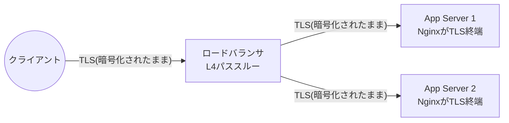

# ロードバランサ・DNS・HTTPS

最終更新: 2026-09-23(フェーズ11)

このドキュメントは、Levelogのロードバランサ配線・DNS設計・HTTPS(TLS)構成を定義する。実装は`terraform/modules/load_balancer`(フェーズ7で作成、本フェーズで公開IP自動払い出しに対応)と`frontend/nginx.conf`(フェーズ4で作成、本フェーズでHTTP→HTTPS転送・TLS終端を追加)。クラウドリソースの作成・`terraform apply`・DNSレコードの変更は本フェーズでも一切行っていない(DNSレコードの変更はユーザーの明示的な許可が必要な操作として指定されているため)。

## 1. TLS終端の位置(設計判断)

さくらのクラウードのロードバランサは**L4(TCP)のパススルー型**であり、TLSの終端機能を持たない。したがって、**TLSは各アプリサーバ自身のNginx(コンテナ)で終端する**ことにした。ロードバランサは暗号化されたTCPストリームをそのまま転送するだけであり、復号は行わない。

この設計の帰結として、**証明書は全アプリサーバに同一のものを配置する必要がある**(どちらがリクエストを受けても同じ証明書で応答できるようにするため)。

## 2. ロードバランサへの登録・ヘルスチェック(本フェーズでの変更)

- フェーズ7時点では、ロードバランサ用の公開IP(`public_switch_id` / `ip_addresses` / `netmask` / `gateway` / `vip_address`)を外部から与える前提の設計だった。本フェーズで、さくらのクラウードの`sakuracloud_internet`(Switch+Router)リソースを`modules/load_balancer`内で直接作成するように変更し、これらの値をすべて自動的に払い出されたものから導出するようにした(`terraform providers schema`で実スキーマを確認済み)。
  - 払い出されたIPアドレスの1・2番目をアクティブ/スタンバイ構成の実IPに、3番目をVIP(仮想IP)に割り当てる設計とした。**実際の払い出し範囲・予約アドレスの並び順は、初回の実`apply`後に`assigned_ip_addresses`出力で必ず確認すること**(推測に基づく設計であり、断定はしていない)。
- アプリサーバ2台の登録・`/health/ready`によるヘルスチェックは、フェーズ7で実装済みの`vip.server`ブロック(動的ブロックでバックエンドIPを展開)がそのまま使われる。本フェーズでは、ポート80と443の両方に対してVIPを作成するように拡張した(次節参照)。

### ネットワーク側パケットフィルタとの循環依存への対応

フェーズ8で実装したアプリサーバの公開パケットフィルタ(`web_allowed_source_cidrs`)を「ロードバランサの実IPのみ許可」に絞り込みたいが、ロードバランサの実IPは`sakuracloud_internet`が作成されて初めて確定するため、単純に`module.load_balancer`の出力を`network`モジュールへ渡すと依存関係が循環する(`network` → `load_balancer` → `app_server` → `network`)。

このため、`environments/production`では**意図的な2段階のブートストラップ**を採用した。

1. 初回`apply`: `lb_known_ip_addresses`変数を既定値(空リスト)のままにする。この場合`web_allowed_source_cidrs`は`0.0.0.0/0`(全世界に公開)のままになる。ヘルスチェック用パスのみが公開される状態であり、実害は限定的だが、恒久的な状態にしないこと。
2. `terraform output`(または`module.load_balancer.active_standby_ip_addresses`)で実際に割り当てられた2つのIPを確認する。
3. `lb_known_ip_addresses`にその2つのIPを設定し、再度`apply`する。これでアプリサーバの公開ポートはロードバランサ経由のみに制限される。

## 3. HTTPからHTTPSへの転送

`frontend/nginx.conf`を2つの`server`ブロックに分割した。

- **ポート8080(平文HTTP)**: `/health/`(ロードバランサ・外形監視からのヘルスチェック)と`/healthz`(Nginx自身の生死確認、コンテナの`HEALTHCHECK`用)だけは転送せずそのまま応答し、それ以外の全リクエストは`https://$host$request_uri`へ301リダイレクトする。ヘルスチェックパスまでリダイレクトしてしまうと、ロードバランサのポート80ヘルスチェックが常に301を受け取ることになり、200を期待する設定では異常判定されてしまうため、明示的に除外している。
- **ポート8443(TLS終端)**: `/etc/nginx/tls/fullchain.pem` / `privkey.pem`を読み込み、既存のロケーション(静的アセット・`/api/`・`/health/`・SPAフォールバック)は`nginx-locations.conf`という共通ファイルに切り出して両方の`server`ブロックから`include`することで重複を避けている。

ロードバランサ側もポート80・443の両方にVIPを持ち、どちらも同じ2台のアプリサーバへ転送する(前節)。

### 実装上のハマりどころ(検証で発見)

- `nginx-locations.conf`を`/etc/nginx/conf.d/`配下に置くと、ベースイメージの`nginx.conf`が`conf.d/*.conf`を**httpコンテキストで自動的に`include`する**ため、その中の`location`ディレクティブが「ここでは使えない」というエラーで起動に失敗した。`/etc/nginx/snippets/`という別ディレクトリに置き、`server`ブロック内から明示的に`include`することで解決した。
- `add_header Content-Type ...`は、nginxの`Content-Type`ヘッダの特殊な扱いにより「置き換え」ではなく「追加」になってしまい、ヘッダが重複することを確認した。`default_type`ディレクティブに変更して解決した。

## 4. 証明書の取得・更新方針

- ロードバランサがL4パススルーであるため、Let's Encrypt等のACME認証局によるHTTP-01チャレンジは、2台あるアプリサーバのどちらが検証リクエストを受け取るか制御できないという問題がある(共有Webルート同期の仕組みを別途用意しない限り、不安定になりうる)。
- そのため、**DNS-01チャレンジを推奨方式とする**。DNS-01は特定のバックエンドに依存せず、DNSのTXTレコードで検証が完結する。
- **DNSプラグイン(フェーズ19で確定)**: certbot公式の`certbot-dns-sakuracloud`を使う。certbot本体と同じリポジトリ(`certbot/certbot`)でメンテナンスされており、Ubuntu 24.04(`os_type = ubuntu2404`)の公式パッケージ`python3-certbot-dns-sakuracloud`としても提供されている(noble/universe、2.9.0-1で確認)。起動スクリプトで`certbot`と一緒にインストールする。
- **初回発行は手動**: さくらのクラウードのAPIキーを`/etc/letsencrypt/sakuracloud.ini`(0600)に置き、`certbot certonly --authenticator dns-sakuracloud ...`を1回実行する(コマンドは`docs/operations-runbook.md`2.3節)。APIキーを起動スクリプトやTerraformに埋め込まない方針は、`.env`・`monitoring.env`と同じ。
- **更新は自動(フェーズ19で実装)**:
  - Ubuntuの`certbot`パッケージに付属する`certbot.timer`(1日2回`certbot renew`、残り30日を切った証明書を更新)を起動スクリプトで有効化する。`certbot renew`は初回発行時に記録された認証方式(DNS-01・認証情報ファイルの場所)をそのまま再利用するので、追加の設定はいらない。
  - 起動スクリプトが`/etc/letsencrypt/renewal-hooks/deploy/levelog.sh`を配置する。発行・更新が成功するたびに、証明書を`/opt/levelog/tls/`へコピーし(`nginx-unprivileged`のuid 101が所有、秘密鍵は0400。一時ファイルに書いてからrenameするので、書きかけのファイルを読まれることはない)、稼働中の`web`コンテナで`nginx -s reload`を実行する(既存の接続は切らない)。`web`コンテナが見つからない場合(初回発行が初回デプロイより前など)は、コピーだけしてコンテナの起動時に読ませる。
  - ローカル検証: 本番構成(`docker-compose.prod.yml`)を起動した状態で、別の証明書を`RENEWED_LINEAGE`としてフックを実行した。コンテナを再起動せずに、配信される証明書が新しいものに切り替わることを確認した。
- **2台構成での扱い**: DNS-01はどのサーバーが検証を受けるかに依存しないため、production 2台はそれぞれ独立に同じドメインの証明書を発行・更新する(1節の「全サーバーに同じ証明書」は「同じドメインに対する有効な証明書」で満たされる。証明書そのものが別物でも、クライアントから見て問題はない)。Let's Encryptの同一ドメイン重複発行の制限(週5回)に対して、2台で90日ごとなので十分余裕がある。
- **更新が止まったときの検知(二重)**: (1) さくらのクラウードの外形監視に`sslcertificate`チェックを追加した(`terraform/modules/monitoring`の`cert_expiry`、残り14日未満で通知)。正常なら30日前に更新されるので、これが通知するのは自動更新が壊れているときだけ。(2) デプロイ後のスモークテスト(`.github/scripts/smoke-test.sh`)も、配信中の証明書の残りが14日未満ならデプロイを失敗させる。
- 証明書(`fullchain.pem` / `privkey.pem`)の配置先は`/opt/levelog/tls/`(起動スクリプトで作成)で、`docker-compose.prod.yml`の`TLS_CERT_DIR`がこのパスをマウントする。

## 5. ローカル検証(自己署名証明書)

実際のLet's Encrypt証明書は実在の公開ドメインが必要なため取得できないが、**自己署名証明書を使ってNginx設定自体の妥当性を検証した**(本番証明書の代用ではなく、設定検証専用であることを明記)。

検証内容と結果は`docs/production-roadmap.md`のフェーズ11節に記載する。

### 5.1 検証で発見した不具合とその修正(本節の追記)

自己署名証明書による実機検証の過程で、実装当初のコードに存在した不具合を1件発見し、修正した。

- **`add_header`継承の欠落によるセキュリティヘッダーの欠落**: `frontend/nginx-locations.conf`では、`X-Content-Type-Options` / `X-Frame-Options` / `Referrer-Policy`をserverコンテキスト相当の位置(`include`先のファイル冒頭)で1回だけ宣言していた。しかしnginxの`add_header`は「現在のコンテキストで1つでも`add_header`を宣言すると、親コンテキストからの継承が(部分的にではなく)完全に打ち切られる」という仕様がある。`location /assets/`と`location = /index.html`は独自に`Cache-Control`を`add_header`で設定していたため、この2箇所からの応答では上記3つのセキュリティヘッダーが一切付与されていなかった。さらに`location /`の`try_files`フォールバックはinternal redirectで`/index.html`に対して再度location解決を行うため、事実上ほぼ全てのHTML応答(SPAのトップページ含む)でセキュリティヘッダーが欠落する状態だった(`location /api/`・`location /health/`は独自の`add_header`を持たないため、この2つは正しく継承されていた)。実機での`curl`比較検証でこの欠落を発見し、`location /assets/`・`location = /index.html`の両方に3つのセキュリティヘッダーを明示的に再宣言することで修正した。

## 6. DNS設計

**DNSレコードの変更はユーザーの明示的な許可が必要な操作であるため、本フェーズでは一切実施していない。** 設計のみ記載する。

| レコード | 種別 | 値 | TTL(推奨) |
| --- | --- | --- | --- |
| `levelog.matsu0122.com` | A | ロードバランサのVIP(`module.load_balancer.vip_address`、実`apply`後に確定) | 300秒程度(切り戻し時に素早く反映できるよう短めを推奨) |
| `staging.levelog.matsu0122.com` | A | staging環境のアプリサーバの公開IP(`module.app_server.public_ip_addresses[0]`、staging構成、フェーズ6で決定済みの通りLBなし) | 300秒程度 |

`matsu0122.com`ゾーン自体が現在どこで管理されているか(レジストラの既定DNS、既存のさくらのクラウードDNS、他社DNS等)を本フェーズでは確認していない。ゾーンの管理場所によって、Terraformでの管理方法(`sakuracloud_dns` / `sakuracloud_dns_record`リソースを使うか、他社DNSであれば別途手動設定が必要か)が変わるため、**実際にDNSレコードを追加する前に、現在のゾーン管理場所をユーザーに確認する必要がある**。

## 7. 片系停止試験(試験計画、未実施)

実際にアプリサーバ2台構成が構築された後(フェーズ10・11の`apply`完了後)に実施する。本フェーズでは実インフラがないため、手順の計画のみを記載する(実施はフェーズ17)。

### 7.1 目的

ロードバランサが、片方のアプリサーバの停止を検知し、正常な方のみへトラフィックを振り分け続けられることを確認する。

### 7.2 手順(計画)

1. 通常時: 両アプリサーバが`vip.server`の`enabled=true`かつヘルスチェック(`/health/ready`)が200を返している状態であることを確認する。
2. App Server 1を意図的に停止する(`docker compose -f docker-compose.prod.yml stop`、またはOS自体をシャットダウン)。
3. ロードバランサのヘルスチェック間隔(`delay_loop`)経過後、App Server 1がロードバランサから切り離され、App Server 2のみへ全トラフィックが振り分けられることを確認する。
4. アプリケーションが継続して正常応答すること(ユーザーへの影響がないこと)をブラウザ・`curl`で確認する。
5. App Server 1を再起動し、ロードバランサのローテーションに自動的に復帰することを確認する。
6. 同様にApp Server 2側でも実施する(役割を逆にして再現性を確認する)。
7. DBアプライアンス側の冗長構成(フェーズ9)が構築された後は、DB側の片系停止試験も別途計画する。

### 7.3 合格基準

- 片系停止中、エンドユーザーからのリクエストが一切失敗しないこと(または既知の許容範囲内のリトライで復旧すること)。
- 停止したサーバーがロードバランサの振り分け対象から自動的に除外されること。
- 復旧したサーバーが自動的にローテーションへ復帰すること。

## 8. 本フェーズでの実装内容(まとめ)

- `terraform/modules/load_balancer`: `sakuracloud_internet`を追加し、公開IP・VIPを自動払い出しに変更。ポート80/443の両方にVIPを持つよう`vip_ports`変数を追加。
- `terraform/environments/production`: LB関連の外部変数(`lb_public_switch_id`等)を削除し、`lb_known_ip_addresses`による2段階ブートストラップ変数に置き換え。
- `frontend/nginx.conf`: HTTP→HTTPSリダイレクト(`/health/`・`/healthz`を除く)とTLS終端(ポート8443)の2ブロック構成に変更。
- `frontend/nginx-locations.conf`(新規): 両ブロック共通のロケーション定義。
- `frontend/Dockerfile`: `EXPOSE 8443`追加、`HEALTHCHECK`を`/healthz`(Nginx自身の生死確認)に変更。
- `docker-compose.prod.yml`: `TLS_CERT_DIR`(必須)のボリュームマウント追加、ポート公開を`80:8080` / `443:8443`に変更。
- `terraform/modules/app_server`: 起動スクリプトに`certbot`のインストールと`/opt/levelog/tls`ディレクトリの作成を追加。
- `frontend/nginx-locations.conf`: 実機検証で発見した`add_header`継承欠落の修正(5.1節参照、`location /assets/`・`location = /index.html`にセキュリティヘッダーを再宣言)。

## 9. 未確定・今後の判断が必要な事項

- `matsu0122.com`ゾーンの現在の管理場所の確認(DNS変更前に必須)
- ~~DNS-01チャレンジ用のcertbotプラグインの選定~~ → フェーズ19で`certbot-dns-sakuracloud`に確定(4節)。ただし`matsu0122.com`ゾーンがさくらのクラウードDNSで管理されていることが前提
- ~~証明書更新の自動化~~ → フェーズ19で実装(4節)
- ロードバランサの`assigned_ip_addresses`の実際の並び順・予約アドレスの確認(初回`apply`後)
- 片系停止試験の実施(フェーズ17)
